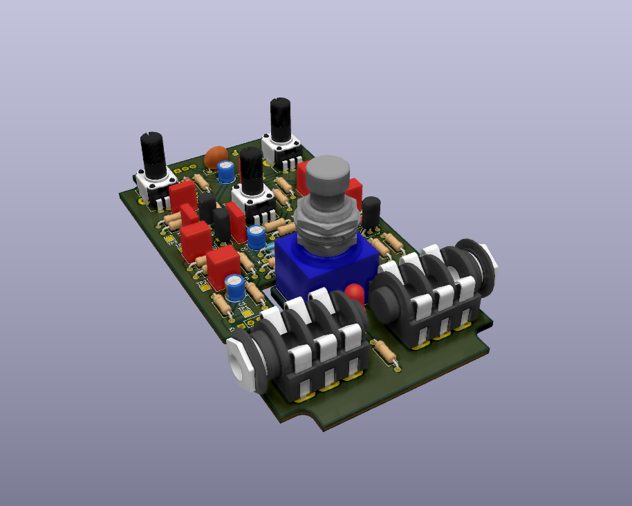

## Fuzz Pedal

This is Fuzz Pedal based on well-known Big Muff PI pedal based on ElectroSmash's
schematics.

### Schematics

### PCB dimensions

### 3D Render of PCB

### Photo of PCB

### Photo of assembled pedal

## Notes

TODO
* Add rubber feets:
  http://www.diyguitarpedals.com.au/shop/index.php?main_page=product_info&cPath=15&products_id=591

Very good template for KiCad:
http://www.caravanelectroworks.com/?p=418

Similar project:
http://rezzonics.blogspot.com/2018/05/nutube-screamer-schematics-bom-layout.html

Hammond case is from Aluminum
-> Use Enamel paint to paint aluminum enclosure

Describe screen printing process

## Cost

TODO
* Calculate BOM
* Time consumption?

## Assembling process

TODO In progress

### Order components & PCB

1. Import BOM to Mouser or Farnell and order components
2. Order the rest of the components from Aliexpress (enclosure, foot switch)
3. Import Gerber files to PCB manufacturer and order PCBs (jlcpcb.com)

### Solder board

1. TODO image of the component placement (print it)
2. Solder Transistors
3. Solder resistors
4. Solder capacitors with polarity
5. Solder capacitors
6. Solder potentiometers, jacks and switch
7.0. Be careful with screwing components
7. Prepare wires, LED with wires and power jack with wires
8. Solder LED wires and wires between boards

### Enclosure processing

TODO describe what instruments to use
1. Mark holes
2. Drill holes
3. Holes polishing
4. Enamel painting
5. Screen printing

### Assemble the pedal

1. Break the board
2. Screw switch and jacks
3. Put power jack into the enclosure
4. Solder power jack wires to the board
5. Put second board into the enclosure and screw the knobs
6. Use thermal glue to fix the board inside the case
7. Screw the bottom of the enclosure

### References

* [ElectroSmash - Big Muff PI analysis](https://www.electrosmash.com/big-muff-pi-analysis)
* [How to "Screen printing"](https://www.youtube.com/watch?v=NS8Q9LUIKA8)
