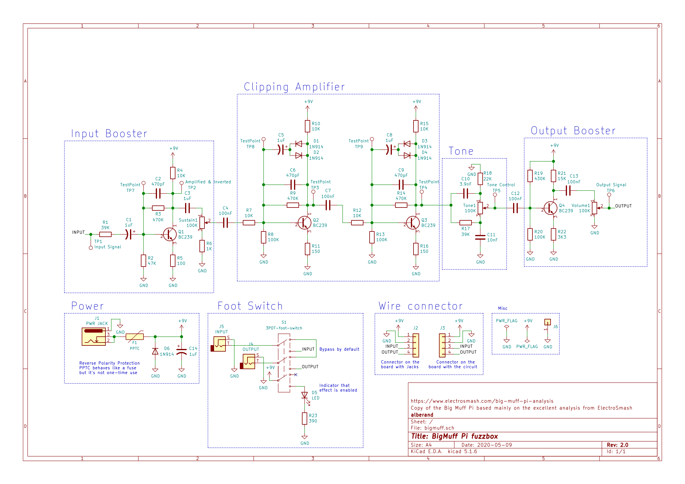
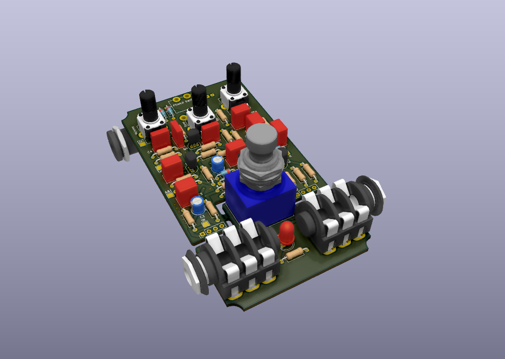

## Big Muff PI fuzzbox pedal

This is copy of the well-known Big Muff PI pedal based on ElectroSmash's
schematics.

### Schematics

### 3D Render of PCB

## Notes

TODO
* Add rubber feets:
  http://www.diyguitarpedals.com.au/shop/index.php?main_page=product_info&cPath=15&products_id=591

Very good template for KiCad:
http://www.caravanelectroworks.com/?p=418

Similar project:
http://rezzonics.blogspot.com/2018/05/nutube-screamer-schematics-bom-layout.html

### References

* [ElectroSmash - Big Muff PI analysis](https://www.electrosmash.com/big-muff-pi-analysis)
