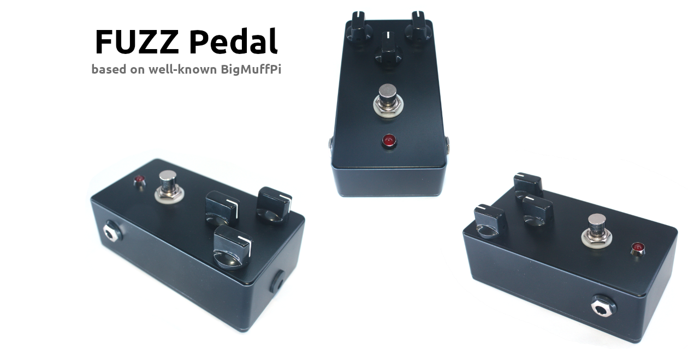
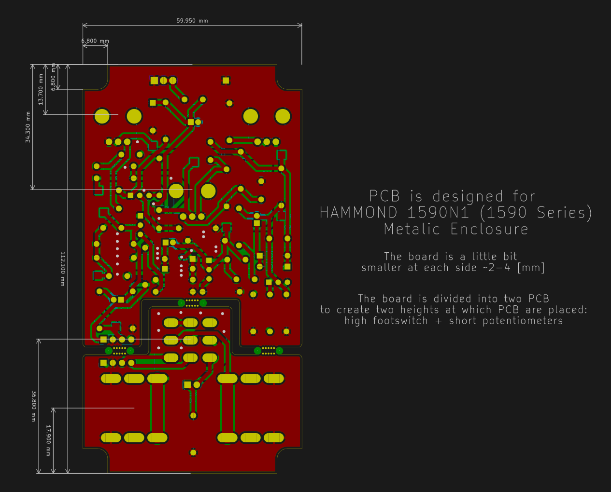
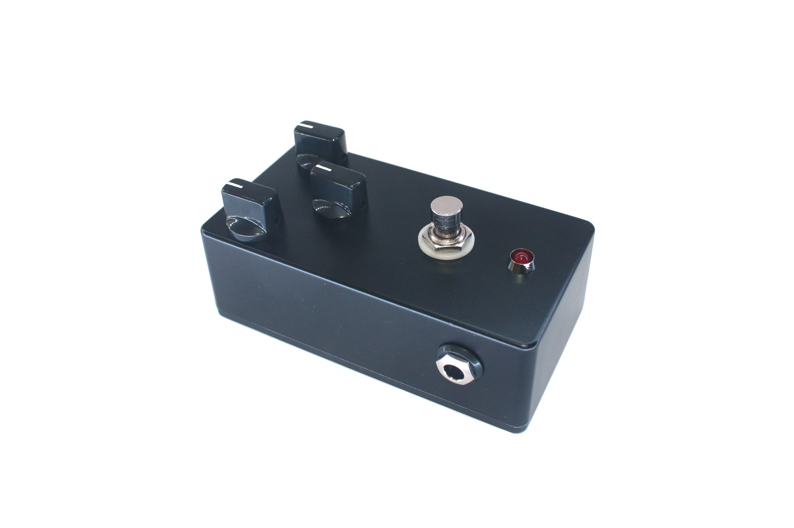

This repository contains a lot of information on how to build a Fuzz Pedal based
on well-known Big Muff PI pedal.

### Schematics

### PCB dimensions

### 3D Render of PCB

### Photo of PCB

### Photo of assembled pedal

### Demo Reconds

        [Play][4] 
        [Play][5] 
        [Play][6] 

## TODO

* Add [rubber feets][1] (After discussion seems to be unnecessary and it's better to have Hook-and-loop fastener)
* Write article on how to paint Aluminum case
* Add template for drilling holes (A4 paper with holes)
* Update BOM (better caps, better LED holder)  - in progress
* Record demo - in progress
* Try screen print on the case
* Describe screen printing process
* Find what to use as a final coat for case painting

## Cost

Here is crude cost calculation of one Pedal. Remember that this doesn't include
any tools. The shipping price could vary (in my case I had many more parcels
😕). In total one pedal cost about 50 - 60 💶 euro (without shipping) + you would
have a few paint sprays.

| Material Type                | Quantity       | Price [EUR] |
|------------------------------|----------------|-------------|
| PCB                          | 5 (min amount) |     8.5     |
| Electronic components & Misc |      1 set     |      25     |
| Case                         |        1       |      11     |
| Ground & Color & Clear Paint |        3       |     6x3     |
| Shipping                     |       ~4       |     20x4    |

How long does it take to make a pedal? If you have any experience in soldering,
painting it will take somewhere around 33 hours mainly due waiting for paint to
dry.

| Activity Type             | Time [hours] |
|---------------------------|--------------|
| Board Soldering           |       5      |
| Case drilling             |       2      |
| Case cleaning & polishing |      0.5     |
| Case painting             |      25      |
| Assembling                |      0.5     |

## Assembling process

TODO In progress

The assebmly process is quite simple. The most time-consuming part is PCB
soldering. Otherwise, you just need to put PCB into box.

### Order components & PCB

1. Import BOM to Mouser or Farnell and order components. The BOM is prepared for
   those to distributors. However, sometimes components aren't in stock and it
   can take months for them to restock them.
2. Order the rest of the components from Aliexpress - enclosure and foot switch.
   Those parts are also available on Amazon. I would recommend to by foot switch
   from amazon as it seems to be in better quality. The case could be also
   ordered from Mouser or Farnell.
3. Import Gerber files to PCB manufacturer and order PCBs. I used jlcpcb.com
   which worked out quite well.

### Solder board

1. TODO image of the component placement (print it)
2. I recommend soldering components in the following order:
    1. Resistors
    2. Electrolytic Capacitors (those with polarity)
    3. Capacitor
    4. Transistors
    5. Diodes
    6. Thermal fuse (yellow)
    7. Potentiometers, Jacks and Switch
    8. Wires between PCBs
3. Prepare wires, LED with wires and power jack with wires
4. Solder wires to LED and to the Power jack, but don't solder it to the board
   yet. Also, don't forget to put heat shrink tubes.
5. Solder the LED to the board 

### Enclosure processing

TODO describe what instruments to use
1. Print the template for the hole placement (TODO not in the repo)
2. Cut the template and attach it to the case with adhesive tape
3. Drill the holes
4. Remove the template and polish the case with different sandpapers (TODO add
   sizes)
5. Paint the case (read the instruction on the spray):
    1. 2 layers of primer
    2. 2 layers of color paint
    3. 1 layers of protection layer
6. Screen printing (TODO)

### Assemble the pedal

1. Break the board
2. Put the LED into the case and screw it to the case
3. Screw switch and jacks
4. Put second board into the enclosure and screw the knobs
5. Put power jack into the enclosure
6. Solder power jack wires to the board
7. Use thermal glue (TODO it doesn't work) to fix the board inside the case
8. Screw the bottom of the enclosure

### References

* [ElectroSmash - Big Muff PI analysis](https://www.electrosmash.com/big-muff-pi-analysis)
* [How to "Screen printing"](https://www.youtube.com/watch?v=NS8Q9LUIKA8)

[1]: http://www.diyguitarpedals.com.au/shop/index.php?main_page=product_info&cPath=15&products_id=591
[2]: http://www.caravanelectroworks.com/?p=418
[3]: http://rezzonics.blogspot.com/2018/05/nutube-screamer-schematics-bom-layout.html
[4]: https://soundcloud.com/user-605705068/fuzzpedal-demo-param-1
[5]: https://soundcloud.com/user-605705068/fuzzpedal-demo-param-2
[6]: https://soundcloud.com/user-605705068/fuzzpedal-demo-param-3
